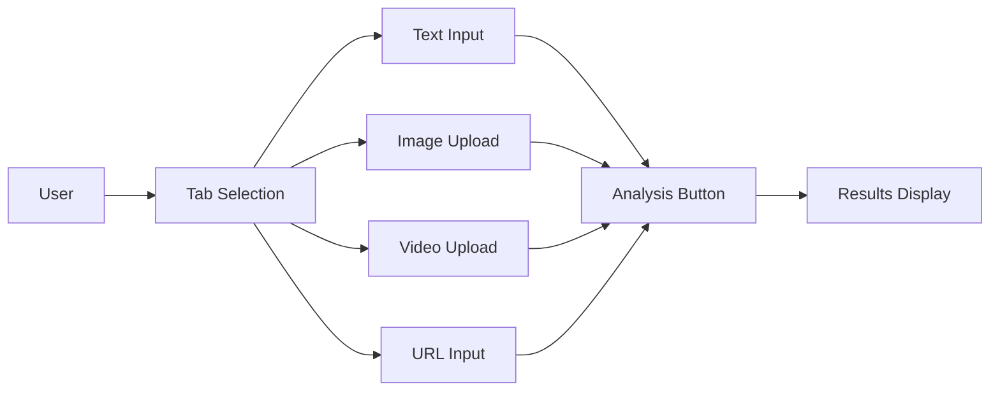
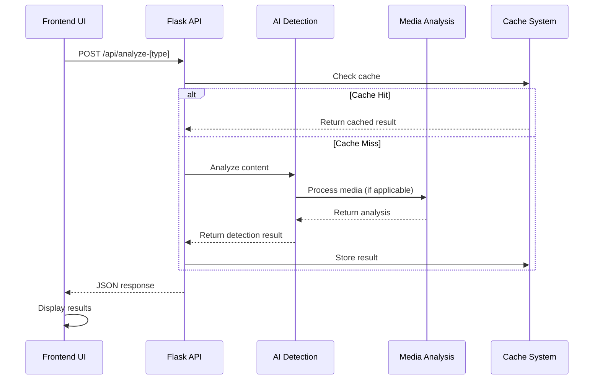
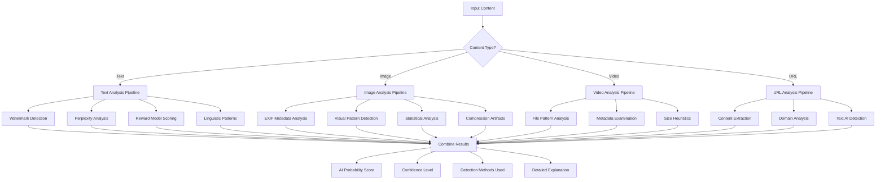
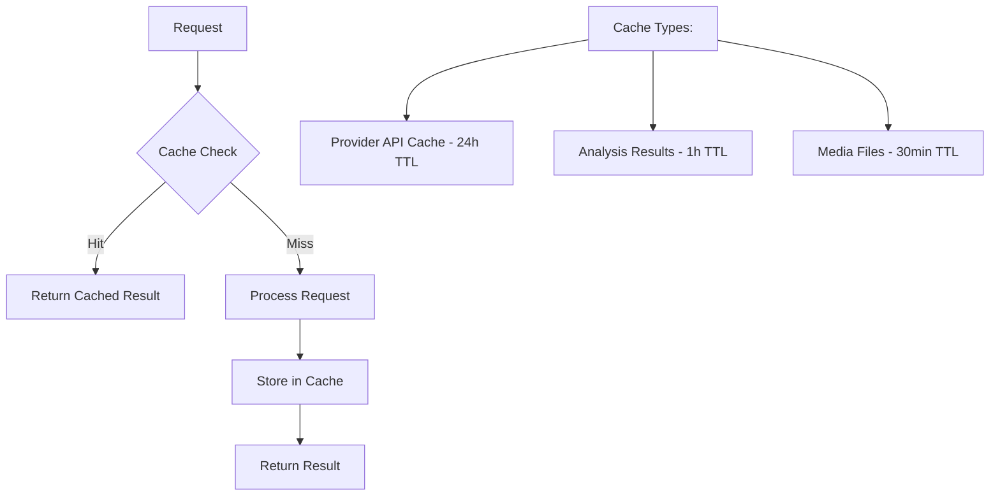

# Filterize - Complete System Architecture & Workflow Documentation

## 🏗️ Project Structure Overview

```
Filterize/
├── 📁 Backend (Python Flask)
│   ├── server.py              # Main Flask application & API endpoints
│   ├── ai_detection.py        # Core AI detection algorithms
│   ├── media_detection.py     # Multi-media analysis (images, videos, URLs)
│   ├── ai_providers.py        # External AI provider integrations

│   ├── local_model.py         # Local ML model training & inference
│   └── check_root.py          # Security utilities
│
├── 📁 Frontend (Static Web App)
│   ├── index.html             # Main UI with tab-based interface
│   ├── app.js                 # JavaScript logic & API communication
│   ├── styles.css             # Responsive styling & animations
│   └── logo.svg               # Branding assets
│
├── 📁 Testing & Utilities
│   ├── run_tests.py           # Test suite runner
│   ├── smoke_test.py          # Basic functionality tests
│   ├── smoke_test_analyze.py  # Analysis endpoint tests
│   ├── run_server.ps1         # PowerShell server launcher
│   └── serve_frontend.ps1     # Frontend development server
│
├── 📁 Configuration
│   ├── requirements.txt       # Core Python dependencies
│   ├── requirements-ml.txt    # Optional ML dependencies
│   ├── env.example           # Environment variables template
│   └── .gitignore            # Git ignore patterns
│
├── 📁 Data & Cache
│   ├── cache/                # API response caching
│   ├── models/               # Trained ML models storage
│   ├── uploads/              # Temporary file uploads
│   └── screen/               # Screenshot utilities
│
└── 📁 Documentation
    ├── README.md             # Project overview & setup
    └── WORKFLOW.md           # This file - complete workflow docs
```

## 🔄 System Workflow & Data Flow

### 1. **User Interface Layer**



**Frontend Components:**
- **Tab Selector**: Switches between Text, Image, Video, and URL analysis modes
- **Input Areas**: 
  - Text: Textarea with placeholder examples
  - Image: Drag-and-drop upload area with preview
  - Video: File upload with video preview
  - URL: Input field with validation
- **Analysis Button**: Triggers appropriate API endpoint based on content type
- **Results Dashboard**: Displays AI detection scores, explanations, and detailed metrics

### 2. **API Layer & Request Flow**



**API Endpoints:**

| Endpoint | Method | Content Type | Purpose |
|----------|--------|--------------|---------|
| `/api/analyze` | POST | JSON | Text content analysis |
| `/api/analyze-image` | POST | multipart/form-data | Image AI detection |
| `/api/analyze-video` | POST | multipart/form-data | Video AI detection |
| `/api/analyze-url` | POST | JSON | URL content analysis |
| `/api/metrics` | GET | - | System performance metrics |
| `/` | GET | - | Serve frontend application |

### 3. **AI Detection Pipeline**



### 4. **Detection Methods & Algorithms**

#### **Text AI Detection Methods:**

| Method | Description | Weight | Key Indicators |
|--------|-------------|--------|----------------|
| **Watermark Detection** | Analyzes token distribution patterns | 40% | Balanced vocabulary, repetitive patterns |
| **Perplexity Analysis** | Measures text predictability | 30% | Low surprise transitions, common phrases |
| **Reward Model Scoring** | Detects helpful/harmless/honest language | 20% | Overly cautious, structured responses |
| **Linguistic Patterns** | Identifies formal AI language structures | 10% | Perfect grammar, formal vocabulary |

#### **Image AI Detection Methods:**

| Method | Description | Weight | Key Indicators |
|--------|-------------|--------|----------------|
| **Metadata Analysis** | Examines EXIF data for AI signatures | 40% | AI software names, missing camera data |
| **Visual Pattern Detection** | Analyzes symmetry and color distribution | 30% | Perfect symmetry, balanced colors |
| **Statistical Analysis** | Checks dimensions and file properties | 20% | AI-standard sizes (512x512, 1024x1024) |
| **Compression Analysis** | Examines file size patterns | 10% | Typical AI compression characteristics |

#### **Video AI Detection Methods:**

| Method | Description | Weight | Key Indicators |
|--------|-------------|--------|----------------|
| **File Pattern Analysis** | Checks filename and size patterns | 60% | AI-related naming, suspicious file sizes |
| **Metadata Examination** | Analyzes video metadata | 30% | Missing typical camera metadata |
| **Domain Analysis** | Checks source URLs and platforms | 10% | Known AI video generation platforms |

#### **URL Content Analysis:**

| Method | Description | Weight | Key Indicators |
|--------|-------------|--------|----------------|
| **Content Extraction** | Scrapes and analyzes text content | 70% | Applies full text AI detection suite |
| **Domain Analysis** | Checks for AI platform domains | 20% | OpenAI, Midjourney, Stability AI domains |
| **HTML Pattern Analysis** | Examines page structure and keywords | 10% | AI-related meta tags and content |

### 5. **Response Format & Data Structure**

**Standard API Response:**
```json
{
  "ai_probability": 0.75,           // 0-1 likelihood of AI generation
  "confidence": 0.85,               // 0-1 confidence in detection
  "detection_methods": [            // Array of methods that contributed
    "watermark",
    "perplexity", 
    "reward_model"
  ],
  "explanation": "High probability...", // Human-readable explanation
  "flags": [                        // Specific indicators found
    "watermark_detected",
    "low_perplexity",
    "high_reward_score"
  ],
  "watermark_detected": true,       // Specific watermark status
  "perplexity_score": 15.2,        // Text predictability score
  "reward_score": 87.5,             // Helpfulness/safety score
  "score": 42,                      // Legacy credibility score (0-100)
  "polarity": -0.2,                 // Sentiment polarity (-1 to 1)
  "used": "local",                  // Analysis method used
  "metadata_analysis": {            // Media-specific analysis
    "exif_data": {...},
    "missing_camera_tags": 3
  },
  "visual_analysis": {              // Image-specific results
    "color_analysis": {...},
    "symmetry_detected": true
  }
}
```

### 6. **Caching Strategy**



**Cache Locations:**
- `cache/provider/` - External API responses
- `cache/media/` - Processed media analysis
- `cache/metrics.json` - System performance metrics

### 7. **Performance Optimizations**

#### **Frontend Optimizations:**
- **Lazy Loading**: Components load as needed
- **Debounced Input**: Prevents excessive API calls
- **Progressive Enhancement**: Works without JavaScript
- **Responsive Images**: Optimized for different screen sizes

#### **Backend Optimizations:**
- **Request Caching**: Reduces duplicate analysis
- **Async Processing**: Non-blocking file operations
- **Memory Management**: Proper cleanup of temporary files
- **Error Handling**: Graceful degradation on failures

#### **Analysis Optimizations:**
- **Early Termination**: Stop analysis when confidence is high
- **Parallel Processing**: Multiple detection methods run concurrently
- **Model Caching**: Keep trained models in memory
- **Batch Processing**: Group similar operations

### 8. **Security & Privacy**

#### **File Upload Security:**
- **Size Limits**: 10MB for images, 50MB for videos
- **Type Validation**: Strict MIME type checking
- **Filename Sanitization**: Prevent directory traversal
- **Temporary Storage**: Auto-cleanup after analysis

#### **API Security:**
- **CORS Configuration**: Controlled cross-origin access
- **Rate Limiting**: Prevent abuse (future enhancement)
- **Input Validation**: Sanitize all user inputs
- **Error Handling**: Don't expose system internals

#### **Privacy Protection:**
- **No Persistent Storage**: Files deleted after analysis
- **Local Processing**: Core analysis runs locally
- **Optional External APIs**: User-controlled provider usage
- **No User Tracking**: No personal data collection

### 9. **Deployment & Scaling**

#### **Development Setup:**
```bash
# 1. Install dependencies
pip install -r requirements.txt
pip install -r requirements-ml.txt

# 2. Start development server
python server.py

# 3. Access application
# Frontend: http://localhost:5000
# API: http://localhost:5000/api/*
```

#### **Production Considerations:**
- **WSGI Server**: Use Gunicorn or uWSGI instead of Flask dev server
- **Reverse Proxy**: Nginx for static file serving and load balancing
- **Database**: Add PostgreSQL/MongoDB for persistent storage
- **Monitoring**: Add logging and performance monitoring
- **Containerization**: Docker for consistent deployments

#### **Scaling Options:**
- **Horizontal Scaling**: Multiple server instances behind load balancer
- **Microservices**: Split AI detection into separate services
- **CDN**: Content delivery network for static assets
- **Caching Layer**: Redis for distributed caching

### 10. **Development Workflow**

#### **Adding New Detection Methods:**
1. **Create Algorithm**: Add method to appropriate detection module
2. **Update Pipeline**: Integrate into main analysis workflow
3. **Add Tests**: Write unit tests for new functionality
4. **Update UI**: Add results display if needed
5. **Document**: Update this workflow documentation

#### **Testing Strategy:**
```bash
# Unit Tests
python run_tests.py

# Smoke Tests
python smoke_test.py
python smoke_test_analyze.py

# Manual Testing
# 1. Test each content type tab
# 2. Upload various file types
# 3. Test different AI-generated content
# 4. Verify error handling
```

#### **Code Organization Principles:**
- **Separation of Concerns**: Clear module boundaries
- **Single Responsibility**: Each function has one job
- **Error Handling**: Graceful failure modes
- **Documentation**: Clear docstrings and comments
- **Type Hints**: Python type annotations where helpful

### 11. **Future Enhancements**

#### **Planned Features:**
- **Real-time Collaboration**: Multiple users analyzing content together
- **API Rate Limiting**: Prevent abuse and ensure fair usage
- **User Authentication**: Personal analysis history and preferences
- **Advanced ML Models**: Integration with latest detection research
- **Batch Processing**: Analyze multiple files simultaneously
- **Export Functionality**: Download analysis reports
- **Plugin System**: Third-party detection method integration

#### **Research Integration:**
- **Latest Watermarking**: Keep up with new watermarking schemes
- **Advanced Perplexity**: Better language model integration
- **Multimodal Detection**: Cross-media analysis (text + image)
- **Adversarial Robustness**: Detect sophisticated AI attempts to evade detection

---

## 🚀 Quick Start Guide

1. **Clone & Setup**:
   ```bash
   git clone https://github.com/Scienceenviorment/Filterize.git
   cd Filterize
   pip install -r requirements.txt
   ```

2. **Run Application**:
   ```bash
   python server.py
   ```

3. **Access Interface**:
   - Open http://localhost:5000
   - Select content type (Text/Image/Video/URL)
   - Upload or input content
   - Click "Analyze" and view results

This unified system provides comprehensive AI detection across all media types with a seamless user experience and robust backend architecture.